# BUBC.co.uk — Rebuild Plan

> A development plan for a ground-up rebuild of the University of Bath Boat Club website. Written to be executed by a human developer with Claude Code assistance. Modern stack, free to run, designed to survive committee turnover.

---

## 0. Project brief

### Mission
Rebuild bubc.co.uk as a fast, beautiful, content-rich site that recruits rowers, engages alumni, attracts sponsors, and outlives the committee that built it.

### Audiences (ranked)
1. **Prospective rowers** — Bath students considering trialling
2. **Parents** — Googling after their kid says "I'm joining the boat club"
3. **Alumni and donors** — looking for news, events, ways to give
4. **Sponsors** — evaluating partnership opportunities
5. **Press / British Rowing / Henley** — race weekend coverage

### Success criteria
- Lighthouse: Performance ≥ 95, Accessibility ≥ 95, Best Practices ≥ 95, SEO ≥ 95
- Time to Interactive < 2s on 4G
- Zero runtime cost (£10/yr domain only)
- A non-developer committee member can publish a race report in under 5 minutes
- Mobile-first; touch targets ≥ 44px; works one-handed
- WCAG 2.2 AA compliant
- Full content type coverage — no Lorem ipsum, no empty pages

### Non-goals (deliberately not building)
- E-commerce store (Rival Kit handles kit; Perry handles blazers; link out)
- Member portal / training log app (use Strava / Concept2 ErgData)
- Live race scoring (link out to British Rowing / regatta sites)
- Self-hosted authentication (Sanity handles editor auth)

---

## 1. Information Architecture

### Sitemap diagram

```mermaid
graph TD
    Home[/ Home /]

    Home --> Squads[/squads/]
    Squads --> SquadMen[/squads/senior-men/]
    Squads --> SquadWomen[/squads/senior-women/]
    Squads --> SquadNovice[/squads/novice/]
    Squads --> Trial[/squads/trial/]

    Home --> Coaching[/coaching/]
    Home --> Boathouse[/boathouse/]
    Boathouse --> Fleet[/boathouse/fleet/]
    Boathouse --> BoatDetail[/boathouse/fleet/:slug/]

    Home --> News[/news/]
    News --> NewsPost[/news/:year/:slug/]
    News --> NewsCategory[/news/category/:slug/]

    Home --> Alumni[/alumni/]
    Alumni --> Meles[/alumni/meles/]
    Alumni --> Events[/alumni/events/]
    Alumni --> Network[/alumni/network/]

    Home --> Support[/support/]
    Support --> Donate[/support/donate/]
    Support --> BuyBoat[/support/buy-a-boat/]
    Support --> Sponsor[/support/sponsor/]
    Support --> Campaigns[/support/campaigns/]
    Support --> CampaignDetail[/support/campaigns/:slug/]

    Home --> About[/about/]
    About --> History[/about/history/]
    About --> Honours[/about/henley-honours/]
    About --> Olympians[/about/olympians/]
    About --> Blazers[/about/blazers/]
    About --> Chairs[/about/chairs/]

    Home --> Committee[/committee/]
    Home --> Welfare[/welfare/]
    Home --> Contact[/contact/]
    Home --> Press[/press/]
    Home --> Results[/results/]

    classDef p0 fill:#0A2540,color:#F5F1EA,stroke:#C9A961,stroke-width:2px
    classDef p1 fill:#1a3a5c,color:#F5F1EA,stroke:#C9A961
    classDef p2 fill:#3d5a7c,color:#F5F1EA

    class Home,Squads,SquadMen,SquadWomen,SquadNovice,Trial,Coaching,Boathouse,News,NewsPost,Support,Donate,BuyBoat,About,History,Committee,Welfare,Contact p0
    class Alumni,Meles,Honours,Olympians,Sponsor,Campaigns,SquadDevelopment,Press p1
    class Fleet,BoatDetail,Network,Events,Blazers,Chairs,Results,NewsCategory p2
```



### Navigation structure

**Primary nav (6 items, max):**
`Squads · Coaching · Boathouse · News · Alumni · Support Us`

**Utility nav (top-right corner, small):**
`Contact · Trial with us (CTA button, accent colour)`

**Footer columns:**
1. **Club** — About, History, Henley Honours, Olympians, Committee, Welfare, Press
2. **Row** — Senior Men, Senior Women, Novice, Trial, Coaching
3. **Support** — Donate, Buy a Boat, Sponsor, Campaigns
4. **Connect** — Newsletter signup, Instagram, YouTube, Strava, contact email, charity number

### Page priority (build order)

| Priority | Pages |
|----------|-------|
| **P0 — launch** | Home, Squads (×3), Trial, Coaching, Boathouse, News index + post, Donate, Buy a Boat, About, History, Committee, Contact, Welfare, 404 |
| **P1 — within 4 weeks of launch** | Alumni, Meles, Henley Honours, Olympians, Sponsor, Campaigns, Press kit |
| **P2 — nice to have** | Fleet visualiser, Results archive (filterable), Alumni map, Blazers, Chairs, Newsletter sub-pages |

### URL migration map (old → new)

Set up via `astro:redirects` so SEO and bookmarks survive.

| Old | New |
|-----|-----|
| `/committee/` | `/committee/` (no change) |
| `/coaching-team/` | `/coaching/` |
| `/facilities-fleet/` | `/boathouse/` |
| `/sponsors/` | `/support/sponsor/` |
| `/history-2/` | `/about/history/` |
| `/senior-squad/` | `/squads/senior-men/` |
| `/women-senior-squad/` | `/squads/senior-women/` |
| `/fundraising/` | `/support/campaigns/` |
| `/donate/` | `/support/donate/` |
| `/single-donation/` | `/support/donate/` |
| `/bubc-alumni/` | `/alumni/` |
| `/meles-boat-club/` | `/alumni/meles/` |
| `/join-meles-bc/` | `/alumni/meles#join` |
| `/events/` | `/alumni/events/` |
| `/our-impact/` | `/support/campaigns/` |
| `/buy-a-boat/` | `/support/buy-a-boat/` |
| `/chairs-of-bubc/` | `/about/chairs/` |
| `/henley-honours/` | `/about/henley-honours/` |
| `/blazers/` | `/about/blazers/` |

---

## 2. Tech stack

### The stack

| Layer | Choice | Why |
|-------|--------|-----|
| **Framework** | Astro 5 | Static-first, fast, content-collection-friendly, partial hydration |
| **Language** | TypeScript (strict) | Type safety for schemas + components |
| **Styling** | Tailwind CSS v4 | Utility-first, no build step in v4, design tokens via CSS vars |
| **CMS** | Sanity (free tier) | Real-time editor, structured content, generous free tier, great image CDN |
| **Forms** | Formspree free tier | 50 submissions/mo, GDPR-OK, spam protection |
| **Hosting** | Vercel (free tier) | Auto-deploys from GitHub, edge cache, generous free tier |
| **DNS / CDN / email** | Cloudflare | Free DNS, free email routing (info@, captain.m@, etc.) |
| **Analytics** | Cloudflare Web Analytics | Free, privacy-friendly, no cookie banner needed |
| **Search** | Pagefind | Static, runs at build time, no server, ~100KB |
| **Repo** | GitHub (private) | Vercel deploy hooks, PR previews |
| **Package manager** | pnpm | Fast, disk-efficient |
| **Linting** | ESLint + Prettier + Astro plugin | Standard |
| **Testing** | Playwright (smoke tests only) | Critical paths: trial form, donate flow, news post |
| **Donations** | Existing Hubbub link | No code, just CTA buttons |

### Why not...

- **Next.js**: overkill for a content site, more dependencies, slower builds
- **WordPress**: this is the whole point — leaving it
- **Webflow / Squarespace**: monthly cost forever, can't build the wow features
- **Gatsby**: deprecated for new builds in 2026
- **Contentful**: free tier too restrictive

### Total annual cost

| Item | Cost |
|------|------|
| Domain (bubc.co.uk renewal) | ~£10/yr |
| Vercel | £0 |
| Sanity | £0 |
| Cloudflare | £0 |
| Formspree | £0 (50/mo limit; upgrade if needed) |
| **Total** | **~£10/yr** |

---

## 3. Repo structure

```
bubc-site/
├── apps/
│   ├── web/                        # Astro frontend
│   │   ├── public/
│   │   │   ├── fonts/              # Self-hosted Fraunces + Geist
│   │   │   ├── og/                 # Static OG fallbacks
│   │   │   └── favicon.svg
│   │   ├── src/
│   │   │   ├── components/
│   │   │   │   ├── layout/         # Header, Footer, Container, Section
│   │   │   │   ├── ui/             # Button, Card, Stat, Tag, etc.
│   │   │   │   ├── content/        # PortableText renderer, Image, etc.
│   │   │   │   ├── home/           # Hero, StatStrip, NewsRail, Pathway
│   │   │   │   ├── squad/          # CrewCard, TrainingSchedule, CoachCard
│   │   │   │   └── boathouse/      # BoatCard, FleetGrid, FleetVisualiser
│   │   │   ├── layouts/
│   │   │   │   ├── BaseLayout.astro
│   │   │   │   ├── PageLayout.astro
│   │   │   │   └── PostLayout.astro
│   │   │   ├── pages/              # File-based routing
│   │   │   │   ├── index.astro
│   │   │   │   ├── 404.astro
│   │   │   │   ├── squads/
│   │   │   │   ├── coaching.astro
│   │   │   │   ├── boathouse/
│   │   │   │   ├── news/
│   │   │   │   ├── alumni/
│   │   │   │   ├── support/
│   │   │   │   ├── about/
│   │   │   │   ├── committee.astro
│   │   │   │   ├── welfare.astro
│   │   │   │   ├── contact.astro
│   │   │   │   └── press.astro
│   │   │   ├── lib/
│   │   │   │   ├── sanity.ts       # Client + image URL builder
│   │   │   │   ├── queries.ts      # GROQ queries
│   │   │   │   ├── types.ts        # Generated types from Sanity
│   │   │   │   └── seo.ts          # Helpers for OG/meta
│   │   │   ├── styles/
│   │   │   │   ├── global.css      # Tailwind layer, custom props
│   │   │   │   └── tokens.css      # Design tokens
│   │   │   └── content/            # Markdown collections (if any)
│   │   ├── astro.config.mjs
│   │   ├── tailwind.config.ts
│   │   ├── tsconfig.json
│   │   └── package.json
│   │
│   └── studio/                     # Sanity Studio
│       ├── schemas/
│       │   ├── documents/          # One file per document type
│       │   ├── objects/            # Reusable inline objects
│       │   ├── singletons/         # homePage, settings
│       │   └── index.ts
│       ├── sanity.config.ts
│       ├── sanity.cli.ts
│       └── package.json
│
├── packages/
│   └── shared/                     # Types/utils shared across web + studio
│
├── docs/
│   ├── HANDOVER.md                 # For next committee
│   ├── CONTENT-EDITING.md          # How to add news, athletes, boats
│   ├── DEPLOYMENT.md
│   └── BRAND.md
│
├── .github/
│   └── workflows/
│       └── ci.yml                  # Lint + typecheck + Playwright
├── .gitignore
├── README.md
├── pnpm-workspace.yaml
└── package.json
```

**Why a monorepo?** Frontend and CMS share types. Sanity Studio is also deployable to its own URL but lives in the same repo for simplicity. pnpm workspaces handle this cleanly.

---

## 4. Design system

### Aesthetic direction

**Editorial heritage athletic.** Think *The Boat Race* programme crossed with a *Monocle* magazine spread. Confident, classical, no-nonsense. Heavy on big photography of crews and water. Sparse use of an accent gold that nods to the BUBC blazer trim.

The brief: this should look like the website of a club that's been around for 60 years and intends to be around for 60 more. Not a startup. Not a sports brand selling protein. A *club*.

### Brand tokens

```css
/* Colour — minimum, no decorative palette */
--ink:        #0A1B2E;   /* deepest navy — text, headings */
--navy:       #0E2A47;   /* primary navy — header, footer, dark sections */
--paper:      #F5F1EA;   /* warm off-white — body background */
--bone:       #ECE5D8;   /* slightly warmer for surfaces */
--gold:       #B8924A;   /* blazer-trim accent — used sparingly */
--avon:       #2D4A3E;   /* deep green — secondary accent */
--blade:      #C8312A;   /* signal red — race day / live indicators only */

/* Type */
--font-display: "Fraunces", Georgia, serif;
--font-body:    "Geist", system-ui, sans-serif;
--font-mono:    "Geist Mono", ui-monospace, monospace;

/* Scale — modular, 1.25 ratio */
--text-xs:    0.75rem;
--text-sm:    0.875rem;
--text-base:  1rem;
--text-lg:    1.125rem;
--text-xl:    1.5rem;
--text-2xl:   2rem;
--text-3xl:   2.75rem;
--text-4xl:   3.75rem;
--text-5xl:   5rem;        /* hero only */

/* Space — 4px base */
--space-1:  0.25rem;
--space-2:  0.5rem;
--space-3:  0.75rem;
--space-4:  1rem;
--space-6:  1.5rem;
--space-8:  2rem;
--space-12: 3rem;
--space-16: 4rem;
--space-24: 6rem;
--space-32: 8rem;

/* Radius */
--r-sm: 2px;
--r-md: 4px;
--r-lg: 8px;
/* deliberately tight; rounded corners feel startup-y */

/* Shadow — used very sparingly */
--shadow-1: 0 1px 2px rgba(10, 27, 46, 0.08);
--shadow-2: 0 4px 12px rgba(10, 27, 46, 0.10);
```

### Typography rules

- **Fraunces** for all display (h1, h2, hero, pull quotes). Optical sizing on. Slight contrast. Use the SOFT axis sparingly.
- **Geist** for everything else. Tabular numbers for stats and results tables.
- No font weight under 400 in body. No italic mixed with bold in the same line.
- Headlines: never centre. Always left-aligned. Tight tracking on display (-0.02em).
- Body line-height: 1.6. Headlines: 1.05–1.15.

### Component patterns

| Component | Notes |
|-----------|-------|
| **Hero** | Full-bleed image, 80vh on desktop, 70vh mobile. Headline in Fraunces, sub in Geist, two CTAs. No carousel. |
| **Stat strip** | Horizontal row of 4–5 numbers + labels. Tabular Geist numerals. Divider lines, no boxes. |
| **News card** | Image 4:5, category tag, headline, date. Hover: image scales 1.02, gold underline on headline. |
| **Crew card** | Square photo, name, seat, year. Tap → modal or sub-page. |
| **Boat card** | Boat profile photo, name in Fraunces, make + class + year, donor tag. |
| **Pull quote** | Fraunces, 1.5em, leading 1.2, gold horizontal rule above. |
| **Button** | Two variants only: solid (navy bg, paper text) and ghost (navy border, navy text). No 3D, no gradients. |
| **Tag** | Small caps, 0.75rem, letter-spacing 0.08em, gold or navy. |
| **Footer** | Dark navy, paper-coloured text, 4-column grid, full-width sponsor strip above. |

### Photography direction

- Wide, environmental, water-heavy. Avoid Instagram-square crops on the web.
- Treat 16:9 as default for editorial imagery, 4:5 for portrait, 1:1 only for committee.
- One signature filter: very subtle warmth + slight contrast lift. Apply consistently.
- Black-and-white acceptable for archive / history pages.

### Motion

- One orchestrated home page entrance with staggered reveals (delay 0ms / 60ms / 120ms / 180ms).
- Subtle parallax on hero scroll (translateY only, 0.3 ratio).
- Hover on cards: image scale 1.02, 300ms ease.
- No scroll-jacking, no full-page animations, no cursor effects.
- Respect `prefers-reduced-motion` everywhere.

### Accessibility checklist

- All colours WCAG AA contrast minimum
- Focus rings: 2px gold outline, 2px offset
- Skip-to-main link
- Semantic HTML always (article, section, nav, main, footer)
- Alt text required on every Sanity image (schema enforces)
- Form labels visible (no placeholder-only labels)
- Tab order matches visual order
- Errors announced via aria-live

---

## 5. Sanity content model

### Document types

```ts
// Concrete schema sketches — Claude Code can scaffold from these.

// SINGLETONS
homePage:   { hero, statStrip, featuredNews, squadPathway, sponsorStrip, ctas }
settings:   { siteTitle, contact, address, social[], navItems[], footer }

// PAGES & TEMPLATES
page:       { title, slug, sections[], seo }           // generic landing
squad:      { name, slug, captain, captainBio,
              trainingSchedule, achievements, photos,
              expectedStandards, contactEmail, seo }
coachIndex: { intro, coaches[] -> coach }

// PEOPLE
coach:           { name, role, slug, photo, bio, qualifications[], email }
committeeMember: { name, role, year, slug, photo, course, email }
athlete:         { name, slug, photo, squad, year, course,
                   height, weight, hometown, prevClub,
                   pb2k, pb5k, achievements[] }
chair:           { name, yearFrom, yearTo, photo, bio }
olympian:        { name, slug, photo, bubcYears, olympicYears[],
                   medals[], story, currentRole }

// BOATS & FLEET
boat:        { name, slug, make, class, weight, yearBought,
               donor, story, photo, currentCrew, status,
               namingCeremonyDate }
fleetLocation: { boat -> boat, bayNumber, x, y }  // for fleet visualiser

// NEWS & EVENTS
newsPost:     { title, slug, category -> category,
                publishDate, author, heroImage,
                excerpt, body, relatedAthletes[], relatedCrews[],
                seo }
category:     { title, slug, description }
event:        { title, slug, date, endDate, location, type,
                description, registerUrl }

// RESULTS
regattaResult: { regatta, year, event, crewName,
                 athletes[] -> athlete, finish, time,
                 video, photos[] }
henleyHonour:  { year, event, crewName, athletes[],
                 cox, coach, finish, opposition }

// FUNDRAISING
sponsor:        { name, slug, logo, website, tier, since, description }
campaign:       { title, slug, status, goalAmount, raisedAmount,
                  donorCount, story, gallery, donateUrl }
boatForSale:    { boatType, priceRange, status }  // for Buy a Boat page

// OBJECTS (reusable)
seo:        { title, description, image, noIndex }
imageBlock: { asset, alt (required), caption, credit }
linkBlock:  { label, url, external }
ctaBlock:   { label, link, variant: 'solid' | 'ghost' }
statBlock:  { value, label, suffix }
```

### Studio configuration

- **Document actions**: disable "duplicate" on singletons; add "Preview" action for news/squad pages pointing to Vercel preview URLs.
- **Custom inputs**: image field with required alt, character counter on excerpt.
- **Roles**: Editor (committee), Admin (one or two people only). Admins can edit settings/nav; Editors can only edit content.
- **Live preview**: Sanity Presentation tool → Astro preview URL.

### Migration plan

A spreadsheet → Sanity import. One column per field. Use `sanity-import` CLI or `@sanity/client` write API.

Priority content to migrate first:
1. Settings (nav, footer, contact)
2. History (great existing copy)
3. Coaching bios (good existing copy, just polish)
4. Squad pages (write fresh; current Lorem ipsum content is unusable)
5. News (port the three news items, then start fresh)

---

## 6. Astro implementation notes

### `astro.config.mjs` essentials

```js
export default defineConfig({
  site: 'https://bubc.co.uk',
  output: 'static',
  integrations: [
    tailwind(),
    sitemap(),
    pagefind(),         // build-time search
    sanity({ projectId, dataset, useCdn: true }),
  ],
  image: {
    domains: ['cdn.sanity.io'],
  },
  redirects: { /* see URL migration map */ },
  prefetch: { prefetchAll: true, defaultStrategy: 'viewport' },
});
```

### Data fetching pattern

- All Sanity queries live in `src/lib/queries.ts` as named exports.
- Pages fetch at build time via `getStaticPaths` and pass typed data to components.
- Use `@sanity/image-url` for responsive images with `srcset`.
- For preview mode, switch client to `useCdn: false` and add a draft mode middleware.

### Performance budget

| Metric | Target |
|--------|--------|
| HTML | < 30 KB compressed |
| Critical CSS | < 14 KB inlined |
| JS (per page) | < 50 KB |
| LCP image | < 200 KB, AVIF/WebP, responsive |
| Total page weight | < 800 KB |
| Web fonts | Self-hosted, `font-display: swap`, subset to Latin |

---

## 7. Phase plan

Each phase has a duration (rough), goal, deliverables, and acceptance criteria. Build in this order.

### Phase 0 — Foundations (Day 1)

**Goal:** repo and toolchain ready; "Hello BUBC" page deployed to a Vercel URL.

- [ ] Create private GitHub repo `bubc-site`
- [ ] `pnpm create astro@latest apps/web --template minimal --typescript strict`
- [ ] Initialise pnpm workspace; add `apps/studio` Sanity project
- [ ] Install Tailwind v4, ESLint, Prettier, lint-staged, husky
- [ ] Connect repo to Vercel; verify auto-deploy on push
- [ ] Add `bubc.co.uk` as Vercel custom domain (preview only at this stage)
- [ ] Cloudflare DNS: set up Email Routing for `info@`, `captain.m@`, `captain.w@`, `treasurer@`, `welfare@`, `alumni@`, `sponsorship@`
- [ ] Create Sanity project (free tier); save project ID + dataset name in `.env`

**Acceptance:** `pnpm dev` runs without warnings; pushing to `main` redeploys; Sanity Studio loads locally.

### Phase 1 — Design system (Days 2–4)

**Goal:** a `/styleguide` page exists demonstrating every component pattern.

- [ ] Set up Tailwind config with brand tokens from §4
- [ ] Self-host Fraunces + Geist via `public/fonts/`; subset and preload
- [ ] Build `BaseLayout.astro` with `<head>` SEO defaults
- [ ] Build `Header.astro` (sticky, scroll-aware), `Footer.astro` (4 columns + sponsor strip)
- [ ] Build UI primitives: `Button`, `Tag`, `Stat`, `Card`, `Container`, `Section`
- [ ] Build a `/styleguide` page rendering every primitive + colour swatches + type scale
- [ ] Configure focus styles, motion-reduce variants, prose styles for editorial copy

**Acceptance:** `/styleguide` renders cleanly; Lighthouse a11y ≥ 95 on styleguide; reduced-motion works.

### Phase 2 — Sanity schemas (Days 5–7)

**Goal:** all schemas defined, Studio deployed, content can be created.

- [ ] Implement all document types from §5
- [ ] Implement singletons with structure overrides (no duplicate, no delete)
- [ ] Image asset extension to require alt text
- [ ] Slug auto-generation from title
- [ ] Deploy Sanity Studio to `studio.bubc.co.uk` (or Sanity-hosted URL)
- [ ] Generate TypeScript types via `sanity typegen`
- [ ] Seed: create one example of every document type for testing

**Acceptance:** all schemas validate; types are generated; example documents exist; Studio is deployed.

### Phase 3 — P0 static pages (Days 8–12)

**Goal:** every must-launch page exists and pulls real Sanity content.

Build in this order, each as its own PR:

- [ ] **Home** — hero, stat strip, news rail (3 latest), squad pathway, sponsor strip, CTAs
- [ ] **Squads index** + 3 detail pages (senior men, senior women, novice)
- [ ] **Trial form** page — Formspree integration, success state, server validation
- [ ] **Coaching** — coach cards with bios
- [ ] **Boathouse** — facilities, location with embedded map, fleet teaser
- [ ] **About** + **History** — port existing history copy with timeline component
- [ ] **Committee** — card grid with photos, names, roles, emails
- [ ] **Contact** — form + addresses + map + safeguarding contact callout
- [ ] **Welfare & Safeguarding** — policies summary, named officer, reporting routes
- [ ] **Donate / Support** — hero, why donate, ways to give, Hubbub link
- [ ] **Buy a Boat** — story, real HTML price table, form
- [ ] **404** — branded, links back home

**Acceptance:** every page passes a11y audit; mobile screenshots reviewed at 375px width; Lighthouse Performance ≥ 90 on each.

### Phase 4 — Dynamic content (Days 13–17)

**Goal:** news system live; results queryable.

- [ ] **News index** — paginated, filterable by category
- [ ] **News post template** — heroImage, body (PortableText), related athletes, share
- [ ] **News category pages**
- [ ] **RSS feed** at `/news/rss.xml`
- [ ] **Henley Honours** page (FINALLY) — table by year with full crew lists
- [ ] **Olympians** — index + detail pages
- [ ] **Results archive** (P1) — filterable by year/regatta
- [ ] **Site search** with Pagefind — global keyboard shortcut `/`

**Acceptance:** publishing a news post in Sanity appears live within 60 seconds via webhook; search returns results from posts, athletes, boats.

### Phase 5 — Polish, integrations, "wow" features (Days 18–21)

**Goal:** the things that make this CV-worthy.

- [ ] Newsletter signup (Buttondown or Beehiiv) in footer + post pages
- [ ] Strava club embed on Home and Squad pages
- [ ] **Fleet visualiser** — SVG of boathouse bays, clickable boats → detail page
- [ ] **Donation thermometer** for active campaigns — pulled from campaign doc
- [ ] **Race countdown banner** for HRR/BUCS — driven by next-event field in settings
- [ ] Cloudflare Web Analytics installed
- [ ] OG image generation per page (use `satori` at build time)
- [ ] Structured data: Organization, SportsTeam, BreadcrumbList, NewsArticle, Event

**Acceptance:** fleet visualiser works keyboard-only; OG images render correctly when shared to Twitter/LinkedIn; structured data validates in Google Rich Results Test.

### Phase 6 — Migration & launch (Days 22–25)

**Goal:** live on bubc.co.uk with no broken links and proper redirects.

- [ ] Full content audit — every page filled, no placeholders, no draft documents
- [ ] Run Pa11y + Lighthouse CI in GitHub Actions, fail PRs that regress
- [ ] Playwright smoke tests for: home loads, news post loads, trial form submits, donate link goes to Hubbub
- [ ] Add all 18 URL redirects from §1 to `astro.config.mjs`
- [ ] DNS cutover — point bubc.co.uk to Vercel
- [ ] Submit XML sitemap to Google Search Console and Bing Webmaster Tools
- [ ] Write `HANDOVER.md`, `CONTENT-EDITING.md`, `DEPLOYMENT.md`
- [ ] Train two committee members on Sanity (record screencast)

**Acceptance:** previous URLs redirect with 301s; no console errors; HANDOVER.md complete.

---

## 8. Claude Code task ladder

For each task: open the linked file or create it; commit with the suggested message; one task per branch.

```
T01  feat: scaffold astro + tailwind + pnpm workspace
T02  feat(studio): scaffold sanity studio in apps/studio
T03  chore: configure eslint, prettier, husky, lint-staged
T04  feat: connect repo to vercel, verify preview deploy
T05  feat(design): add brand tokens, fonts, base layout
T06  feat(ui): button, tag, stat, card, container primitives
T07  feat(layout): header with sticky scroll behaviour
T08  feat(layout): footer with 4-col + sponsor strip
T09  feat: build /styleguide page
T10  feat(cms): settings + homePage singleton schemas
T11  feat(cms): squad, coach, committeeMember, athlete schemas
T12  feat(cms): boat, sponsor, campaign schemas
T13  feat(cms): newsPost, category, event schemas
T14  feat(cms): henleyHonour, regattaResult, olympian schemas
T15  feat(cms): require alt text on all image assets
T16  feat(cms): generate ts types, wire up sanity client
T17  feat(home): hero component
T18  feat(home): stat strip, news rail, sponsor strip
T19  feat(home): squad pathway component
T20  feat(squads): index + 3 detail pages
T21  feat(squads): trial form with formspree
T22  feat(coaching): coach cards
T23  feat(boathouse): facilities + fleet teaser + map
T24  feat(about): history timeline component
T25  feat(committee): card grid
T26  feat(welfare): policy page
T27  feat(support): donate + buy-a-boat
T28  feat(news): index, post template, rss
T29  feat(news): pagefind search
T30  feat(about): henley honours table
T31  feat(about): olympians index + detail
T32  feat(boathouse): fleet visualiser svg
T33  feat(support): campaign thermometer
T34  feat: og image generation with satori
T35  feat: structured data injection
T36  chore: playwright smoke tests
T37  chore: lighthouse ci in github actions
T38  chore: 301 redirects from old urls
T39  docs: handover.md, content-editing.md, deployment.md
T40  chore: dns cutover to vercel
```

Each task is small enough to fit one PR. Claude Code should run lint + typecheck before opening.

---

## 9. Handover documentation

Three files, all in `docs/`. Each must be readable by a non-developer.

### `HANDOVER.md` — The one page that matters

- One-sentence purpose of each system (Vercel, Sanity, Cloudflare, GitHub)
- Where every credential lives (recommended: 1Password shared vault)
- Who owns the domain renewal and when it's due
- Emergency rollback procedure
- Names + emails of every previous maintainer (rolling list)

### `CONTENT-EDITING.md` — For the Comms Officer

Step-by-step: how to log into Sanity, how to add a news post, how to upload a photo with alt text, how to publish, how to schedule.

Include screen recordings (Loom) for each task.

### `DEPLOYMENT.md` — For the developer-successor

How auto-deploy works, how to roll back, how to add a new page, how to update Sanity schema, how to add a new committee member's edit access.

---

## 10. CV-worthy talking points

Things to be able to articulate when this is on your CV:

- **Stack** — Astro 5 with TypeScript strict mode, Tailwind v4, Sanity headless CMS, deployed to Vercel edge
- **Performance** — Lighthouse 95+ across all four categories; LCP under 1.2s; total bundle under 50KB JS
- **Accessibility** — WCAG 2.2 AA; tested with Pa11y in CI; keyboard-only navigable; screen-reader tested
- **Architecture** — Monorepo with pnpm workspaces; shared TS types between CMS schemas and frontend
- **Migration** — Took a 60-year-old club off a slow, vulnerable WordPress + Elementor stack; preserved SEO via 18 301 redirects; zero downtime cutover
- **Content modelling** — Designed 17 document types covering athletes, boats, news, results, campaigns, with composable PortableText blocks
- **DX** — One-command setup; Lighthouse CI gates PRs; preview deploys per branch; Sanity preview matches production
- **Cost** — Reduced operating cost from £X/yr WordPress hosting to £10/yr domain only
- **Sustainability** — Wrote handover docs and trained two non-developer successors; project survives committee turnover

Don't just list the stack. Talk about the decisions: why Astro over Next, why Sanity over Contentful, why monorepo, why static. Decisions are what employers care about.

---

## 11. Open questions to resolve before Phase 0

These need answers from the BUBC committee, not from Claude Code:

1. **Domain control** — who currently owns the `bubc.co.uk` domain registration? Get the login.   -  we already own the domain
2. **Hubbub** — keep using the existing `bath.hubbub.net/p/BUBC/pledge/` link, or switch to a new donate provider?   - not a priority, just link
3. **Hosting** — is the current WP host on contract, or month-to-month? Plan the cancellation.
4. **Email** — does the club currently have a Google Workspace, or is it all forwarded to personal gmails?   -  think it is all just personal
5. **Brand** — is there an existing brand guide / colour spec, or are we defining one from scratch?    - defining from scratch, use uni of bath colours
6. **Photos** — who owns the existing photography? Can we get hi-res originals? Plan a new shoot?   -   we own photos 
7. **Welfare officer** — name and contact for the dedicated welfare page.   - can sort later when doing comitee
8. **Charity status** — is BUBC registered as a charity? Charity number for footer?
9. **Sanity admins** — who are the two committee members with admin access?
10. **GitHub access** — who has push rights to `main`? PR approval rules?

---

## 12. Useful prompts for Claude Code

Paste these into Claude Code with this plan in context:

```
"Read the BUBC development plan in this repo. Start with task T01 — 
scaffold the astro app and pnpm workspace. Use strict TypeScript. 
Stop after the workspace builds and ask before continuing to T02."

"Read §5 of the BUBC plan. Implement the squad document schema in 
apps/studio/schemas/documents/squad.ts. Include the validation rule 
that captainBio is required and excerpt is max 200 characters. 
Generate types when done."

"Implement the Hero component for the home page as specified in §4 
(component patterns) and §7 phase 3. Use the brand tokens from §4. 
Image should be a Sanity reference, 16:9 desktop, 4:5 mobile. 
Include reduced-motion variant."

"Add 301 redirects from §1 URL migration map to astro.config.mjs. 
Verify each one with a smoke test."
```

---

*Last updated: pre-build. Update this plan as decisions are made — it should be the single source of truth.*
